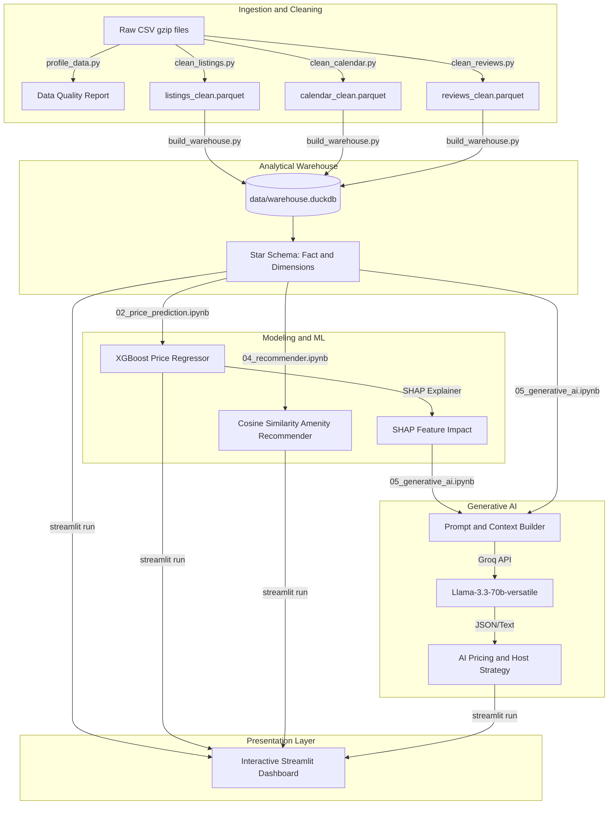

# Barcelona Airbnb Market Intelligence Platform

### Enterprise Data Pipeline, Machine Learning, and Generative AI Analytics Engine

*Expernetic Data Engineering Technical Assignment*

---

## Executive Overview

This repository hosts a production-grade, end-to-end data platform built to ingest, clean, store, model, and analyze short-term rental data from the Inside Airbnb Barcelona June 2026 snapshot.

The system implements a classic ELT pipeline leveraging DuckDB as a high-performance, serverless analytical warehouse. It integrates an XGBoost regression model for predictive pricing, a cosine-similarity-based content recommender to address cold-start recommendations, and a Generative AI Dynamic Pricing Advisor powered by Groq to translate model explainability metrics into business-facing strategy. The entire workflow is surfaced through a responsive Streamlit dashboard.

---

## System Architecture and Data Flow



---

## Repository Structure

```text
EXPERNETIC/
├── app/
│   └── streamlit_dashboard.py
├── data/
│   ├── raw/
│   ├── processed/
│   └── warehouse.duckdb
├── experiments/
├── models/
│   ├── xgboost_model.joblib
│   ├── model_meta.joblib
│   └── shap_explainer.joblib
├── notebooks/
│   ├── 01_eda.ipynb
│   ├── 02_price_prediction.ipynb
│   ├── 03_nlp_reviews.ipynb
│   ├── 04_recommender.ipynb
│   └── 05_generative_ai.ipynb
├── reports/
│   ├── figures/
│   ├── Final_Report_Extended.md
│   ├── assumptions_and_decisions_log.md
│   ├── data_profile_raw_output.txt
│   └── market_intelligence_briefings.txt
├── scripts/
│   ├── run_pipeline.py
│   └── train_model.py
├── src/
│   ├── clean_listings.py
│   ├── clean_calendar.py
│   ├── clean_reviews.py
│   ├── build_warehouse.py
│   ├── profile_data.py
│   └── logging_config.py
├── tests/
├── pyproject.toml
├── requirements.txt
└── README.md
```

---

## Quick Start and Setup

This repository is designed to run in a localized Python environment on Windows with Visual Studio Code.

### 1. Environment activation and dependencies

```powershell
python -m venv venv
.\venv\Scripts\Activate.ps1
pip install -r requirements.txt
```

### 2. Configure environment variables

Copy the environment template and add the required values:

```bash
cp .env.example .env
```

If you plan to use the generative AI features, set your Groq API key in the environment:

```env
GROQ_API_KEY=your_key_here
```

### 3. Run the data pipeline

```bash
python scripts/run_pipeline.py
```

This runs the profiling, cleaning, and warehouse build steps in sequence.

### 4. Train the model

```bash
python scripts/train_model.py
```

This trains the pricing model and writes experiment metadata and model artifacts to the models and experiments folders.

### 5. Launch the dashboard

```bash
streamlit run app/streamlit_dashboard.py
```

---

## Streamlit Dashboard Walkthrough

The Streamlit dashboard acts as the primary visualization layer for the analysis. It is structured around a set of tabs covering market overview, geographic analysis, host intelligence, AI pricing guidance, and AI-generated market briefings.

---

## Analytics and Database Schema

The platform implements a star-schema-style model in DuckDB designed to support analytical queries efficiently.

### Fact table

* fact_listing_performance: captures nightly price, availability, review aggregate scores, occupancy proxies, and derived performance indicators.

### Dimension tables

* dim_listing: contains property capacities, room types, and listing-level attributes.
* dim_neighbourhood: stores neighbourhood names and groupings.
* dim_host: stores host-level characteristics such as superhost status and portfolio size.

---

## Modeling and AI

### Price prediction with XGBoost

* Goal: predict log-transformed price values to handle right-skewness and improve model stability.
* Accuracy: R-squared and MAE are reported in the analysis notebooks and final report.
* Explainability: SHAP values are used to interpret the most influential predictors.

### Recommendation engine

* Strategy: a cosine-similarity-based recommender operates on amenity vectors and provides cold-start-friendly recommendations.

### Generative AI advisor

* Strategy: the notebook-based workflow uses Groq LLM responses to translate explainability outputs into executive and host-facing recommendations.

---

## Key Project Reports

* Comprehensive Final Report: a detailed written report covering methodology, statistical testing, modeling, and business interpretation.
* Assumptions and Decisions Log: documents critical engineering decisions and their trade-offs.
* Data profile outputs and market intelligence briefings are also included in the reports directory.

---

## Quality and Infrastructure

The project includes several improvements to support maintainability and reproducibility:

* centralized configuration in pyproject.toml for Black, Ruff, mypy, and pytest,
* structured logging in the ETL modules instead of ad hoc print-based output,
* type hints for core pipeline functions,
* idempotent processing behavior with optional force re-runs,
* automated tests and a GitHub Actions workflow for linting, typing, tests, and Docker builds.

---

## Testing

Run the test suite locally with:

```bash
pytest
```

Additional quality checks:

```bash
ruff check .
mypy src/
```
