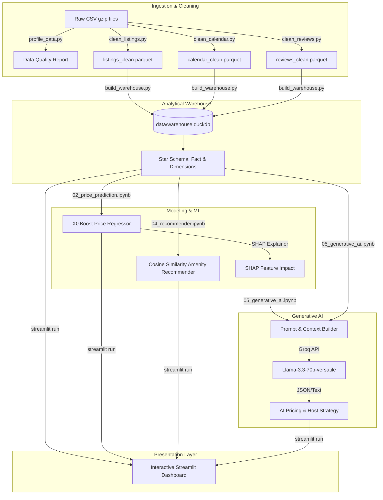

# Barcelona Airbnb Market Intelligence Platform
### Enterprise Data Pipeline, Machine Learning, and Generative AI Analytics Engine
*Expernetic Data Engineering Technical Assignment*

---

## 📋 Executive Overview
This repository hosts a production-grade, end-to-end data platform built to ingest, clean, store, model, and analyze short-term rental data from the **Inside Airbnb Barcelona (June 2026 Snapshot)**. 

The system implements a classic **ELT (Extract-Load-Transform) pipeline** leveraging **DuckDB** as a high-performance, serverless analytical warehouse. It integrates an **XGBoost regression model** for predictive pricing, a **Cosine-Similarity based content recommender** to solve the user/item cold-start problem, and a **Generative AI Dynamic Pricing Advisor** powered by **Groq (Llama-3.3-70b)** to translate complex model explainability metrics (SHAP values) into human-readable business strategy. The entire system is surfaced through a responsive, multi-tab **Streamlit dashboard**.

---

## 🏗️ System Architecture & Data Flow



---

## 📂 Repository Structure

```directory
EXPERNETIC/
├── app/
│   └── streamlit_dashboard.py      # 5-Tab Interactive Streamlit Application
├── data/
│   ├── raw/                        # Ingested Raw CSV files (Git ignored)
│   ├── processed/                  # Standardized Parquet files
│   └── warehouse.duckdb            # DuckDB Analytical Database File
├── models/
│   ├── xgboost_model.joblib        # Serialized XGBoost regression model
│   ├── model_meta.joblib           # Preprocessing medians & metadata
│   └── shap_explainer.joblib       # Serialized SHAP TreeExplainer
├── notebooks/
│   ├── 01_eda.ipynb                # Statistical Exploratory Data Analysis
│   ├── 02_price_prediction.ipynb   # XGBoost Model Training & Persistence
│   ├── 03_nlp.ipynb                # Text Sentiment analysis on Reviews
│   ├── 04_recommender.ipynb        # Content-based Recommender System
│   └── 05_generative_ai.ipynb      # LLM Pricing Advisor & MLOps Design
├── reports/
│   ├── figures/                    # Exported high-quality visualizations
│   ├── Final_Report_Extended.md    # Comprehensive analytical & technical report
│   ├── assumptions_and_decisions_log.md # Critical log of pipeline design choices
│   ├── data_profile_raw_output.txt # Raw data profiling diagnostic output
│   └── market_intelligence_briefings.txt # GenAI generated market narratives
├── src/
│   ├── clean_listings.py           # Listings cleaning & transformation script
│   ├── clean_calendar.py           # Calendar cleaning & transformation script
│   ├── clean_reviews.py            # Reviews cleaning & transformation script
│   ├── build_warehouse.py          # DuckDB database star schema builder
│   └── profile_data.py             # Data quality & profiling script
├── tests/
│   └── test_pipeline.py            # Basic automated pipeline tests
├── .env.example                    # Environment variable template
├── requirements.txt                # Python package dependencies list
└── README.md                       # Repository overview and guide
```

---

## ⚡ Quick Start & Setup

This repository is designed to run in a localized Python environment on Windows (VS Code preferred).

### 1. Environment Activation & Dependencies
Clone the repository, initialize your virtual environment, and install package dependencies:
```powershell
# Create virtual environment
python -m venv venv

# Activate on Windows PowerShell
.\venv\Scripts\Activate.ps1

# Install requirements
pip install -r requirements.txt
```

### 2. Configure Environment Variables
Copy `.env.example` to `.env` in the root directory:
```bash
cp .env.example .env
```
Open `.env` and add your Groq API Key:
```env
GROQ_API_KEY=gsk_your_actual_key_here
```

### 3. Run the Data Pipeline
Run the ELT pipeline scripts sequentially to clean raw datasets and populate the analytical warehouse:
```bash
# 1. Profile raw data quality
python src/profile_data.py

# 2. Clean individual entities
python src/clean_listings.py
python src/clean_calendar.py
python src/clean_reviews.py

# 3. Build DuckDB Star Schema
python src/build_warehouse.py
```
This builds and populates `data/warehouse.duckdb`.

### 4. Run Machine Learning & GenAI Workflows
Ensure the models are trained, evaluated, and serialized by running the Jupyter notebooks inside the `/notebooks` folder or running the helper script:
```bash
python bootstrap_models.py
```
This generates the serialized artifacts in `models/` required by the dashboard.

### 5. Launch the Streamlit Dashboard
Execute the dashboard via the Streamlit CLI:
```bash
streamlit run app/streamlit_dashboard.py
```

---

## 🖥️ Streamlit Dashboard Walkthrough

The Streamlit dashboard acts as the primary visualization layer. Below are placeholders for tab-specific screenshots to capture once deployed:

### 1. Market Overview Tab
High-level KPIs, price distribution histograms, and interactive filter controls (neighbourhood, room type, capacity).
> **[INSERT SCREENSHOT: Market Overview tab interface showing price histograms and metrics]**

### 2. Geographic & Spatial Analysis Tab
Geographic price tier mappings, spatial distributions, and average pricing gradients across Barcelona.
> **[INSERT SCREENSHOT: Spatial Analysis map visualization showing district price trends]**

### 3. Host Intelligence Tab
Insights on market concentration, portfolio sizes, professionalization rates, and the Superhost review premium.
> **[INSERT SCREENSHOT: Host Portfolio Concentration showing power-law dominance]**

### 4. AI Pricing Advisor Tab
Our flagship predictive and generative tab. Input listing parameters to get an XGBoost price estimate, local percentiles, SHAP feature impact, and dynamic strategy from Llama-3.
> **[INSERT SCREENSHOT: AI Pricing Advisor tab displaying LLM recommendation and SHAP bars]**

### 5. AI Market Briefings Tab
Auto-generated executive briefs, host positioning guidelines, and regulatory alerts regarding the 2028 HUTB licence expiry cliff.
> **[INSERT SCREENSHOT: AI briefings text interface showing generated market narrative]**

---

## 📊 Analytics and Database Schema

The platform implements a star schema model in DuckDB designed to minimize analytical query latency.

### Fact Table
* `fact_listing_performance`: Captures nightly prices, availability, review aggregate scores, occupancy proxies, and derived revenue estimates.

### Dimension Tables
* `dim_listing`: Property capacities, room types, clean parsed amenity arrays, and compliance night constraints.
* `dim_neighbourhood`: Centroid spatial coordinates and administrative district groupings.
* `dim_host`: Superhost indicators, total listings counts, response rates, and tenure metrics.

---

## 🧠 Modeling & AI

### Price Prediction (XGBoost)
* **Goal**: Predict log-transformed price (`log1p(price)`) to handle right-skewness.
* **Accuracy**: R² = 0.857, MAE = €50.36.
* **Explainability**: Integrated using SHAP TreeExplainer, showing that minimum night constraints and capacity are the primary price drivers.

### Recommendation Engine (Cosine Similarity)
* **Strategy**: One-hot encoded amenity vectors mapped to cosine space.
* **Solution**: Completely cold-start safe; offers recommendations for the 23.2% of listings that have never been reviewed.

---

## 📖 Key Project Reports
* **[Comprehensive Final Report](file:///reports/Final_Report_Extended.md)**: Exhaustive 30-page write-up covering all methodology, statistical hypothesis testing (H1 to H5), model diagnostics, and Responsible AI mitigation.
* **[Assumptions & Decisions Log](file:///reports/assumptions_and_decisions_log.md)**: Logs critical architecture decisions (e.g., median imputations, log transformations, DuckDB vs. Postgres).

---

## 🚀 MLOps & Future Roadmap
1. **Airflow Orchestration**: Automate the monthly scrape ingest from Inside Airbnb.
2. **Evidently AI**: Integrate drift monitoring to trigger automated retraining when feature distributions shift.
3. **Aspect-Based Sentiment (BERT)**: Fine-tune BERT on reviews to extract specific complaints (e.g. noise, broken amenities).
